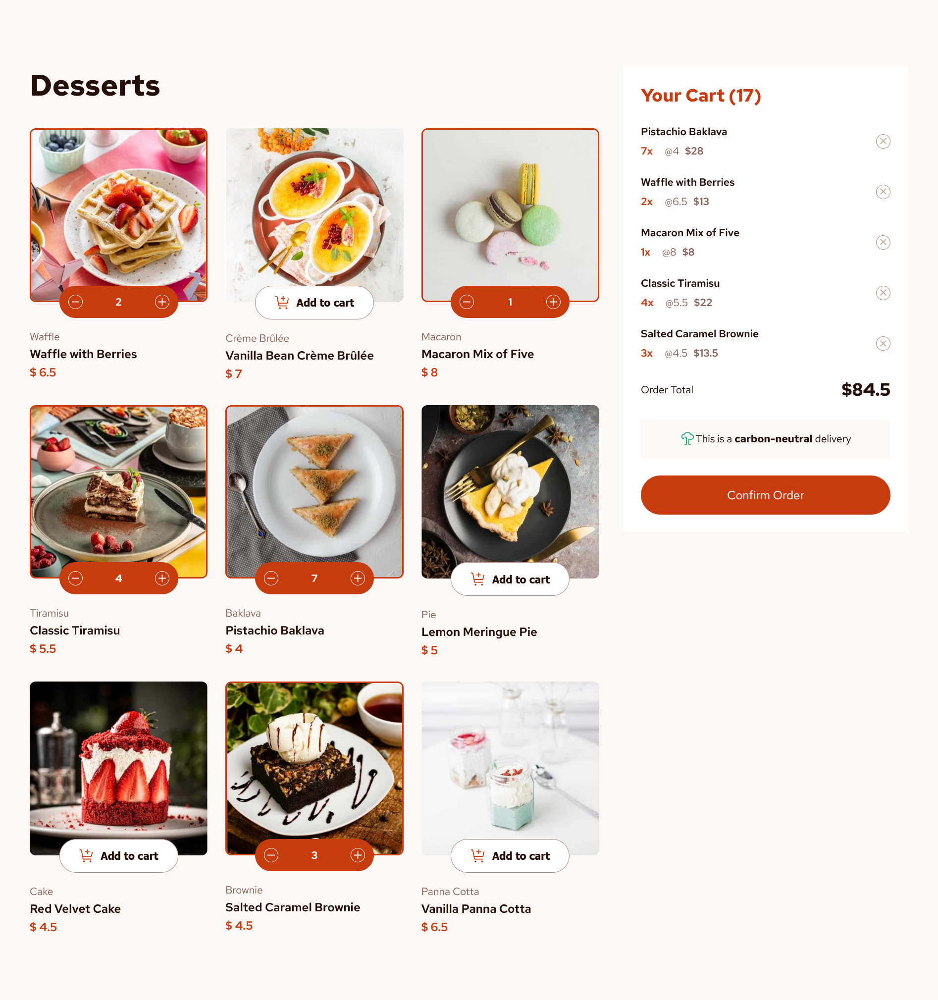

 # 🛍️ React E-commerce Product Cart App

A sleek, accessible, and responsive e-commerce front-end built with **React + Vite**. It includes a dynamic product list, add-to-cart functionality, and modal-based order confirmation — all powered by clean code, conditional rendering, and modern UX practices.

> ✅ Beginner-friendly. ⚙️ Real-world logic. ♿ Accessibility focused.

---

## 📸 Preview

  

---

## 🔗Links
-- Live site URL: 

## 🚀 Features

- ✅ Load product data from a local JSON file
- ✅ Display responsive images based on device type (mobile, tablet, desktop)
- ✅ Add to cart, increase/decrease item quantity
- ✅ Live total price calculation using `.reduce()`
- ✅ Accessible ARIA announcements (`aria-live`)
- ✅ Screen reader-friendly modal with focus lock and no-scroll background
- ✅ Loading indicator and 3s confirmation delay on order
- ✅ Smooth scroll back to top on "Start New Order"
- ✅ Semantic HTML, clean component structure

---

## 🧰 Tech Stack

| Technology    | Usage |
| ------------- | ----- |
| **React**     | UI and state management |
| **Vite**      | Project bundler (fast dev server) |
| **CSS**       | Styling and media queries |
| **JavaScript**| Core logic and array methods |
| **ARIA Roles**| Accessibility improvements |
| **ESLint + Prettier** |  Linting and code formatting |

---

## 📁 Project Structure

src/
│
├── components/
│ ├── ProductList.jsx
│ ├── ProductCard.jsx
│ ├── Cart.jsx
│ ├── CartItem.jsx
│ ├── ConfirmationModal.jsx
│
├── data/
│ └── data.json
│
├── App.jsx
├── main.jsx

- `data.json` – contains an array of product objects with responsive image paths
- Components are split for reusability and clarity

---

## 📦 Getting Started

1. **Clone the repository**
```bash
git clone https://github.com/yourusername/react-product-cart.git
cd react-product-cart 
```
2. **Install dependencies**
```bash 
npm install
```
3. **Start the dev server**
```bash
npm run dev
```
4. **Build for production**
```bash
npm run build
```

## 🧪 Key Concepts Demonstrated

- State lifting for sharing cart logic between components
- Conditional rendering to hide/show UI based on interaction
- Object-based cart to manage multiple products by ID
- Array methods like .reduce(), .map(), .filter() in context
- Responsive design with image swapping
- Accessibility using:
    - aria-label, aria-live, tabIndex
    - Hidden screen-reader-only divs (.sr-only)
    - Scroll locking during modals

## 🔊 Accessibility Highlights

- Screen reader announces “Order confirmed” when modal pops up
- Cart buttons are reachable via keyboard (Tab)
- Focus is managed inside modal
- Modal background is not scrollable when active
- Custom ARIA labels for buttons (e.g. "Add {name} for {price} to cart")

## 🧠 What I Learned
“This project taught me how to bring interactivity, accessibility, and responsive behavior together in a real-world React app. I deepened my understanding of useState, component props, conditional rendering, .reduce(), and managing shared state like the cart.”